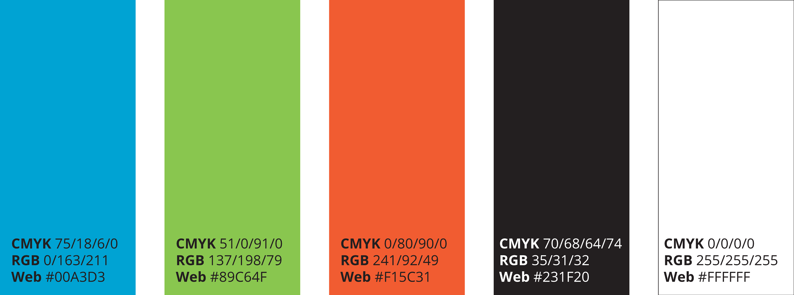
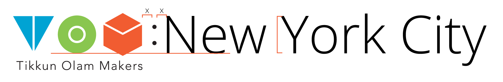

### Part 5: **Brand guidelines**

**Event name:** When writing or speaking about your event, always use TOM:cityname. i.e.: TOM:Moscow

**You: **When speaking about the event, you are the licensed organizer of TOM:cityname. You are not an employee of TOM, please do not present yourself as one. i.e.: My name is Rebecca, I'm the licensed organizer of TOM:Moscow.

1. **The official TOM logo and brand: **The official TOM logo should be used **_sparingly_**, this is your TOM event and we want you to put your Makeathon logo front and center. Download logo [here](http://static1.squarespace.com/static/56d2f7d71bbee09a4bcca663/t/56dc013e27d4bd867dd62912/1457258814604/RLogos_TOM_Eng_Tag.png).

* When the official TOM logo appears, it appears like this:

* When the full name is written, use uppercase in the beginning of each word, like this: Tikkun Olam Makers.

* When referring to the organization as the acronym, TOM, always write using uppercase characters.

* When referring to TOM in a different language, always refer to the organization and write it as TOM or TOM: Tikkun Olam Makers and do not translate it.

2. **Your local TOM logo:** We will provide you the open files to create your own logo, or you can request our team to design it for you. Once you complete your local TOM logo, you will design a local TOM graphic to compliment the logo.

3. **[Your local TOM graphic](brand-guidelines.md#graphic)** You will have the option to design a graphic reflecting the local flavor and culture. Keep it family friendly and have fun.

Let's compare the two logos, there are some similarities so that the global TOM brand is recognized, but you can see at a glance that your local TOM is designed for you and your event!

<table>
  <tr>
    <td>The official TOM logo</td>
    <td>Your local TOM logo</td>
  </tr>
  <tr>
    <td></td>
    <td></td>
  </tr>
  <tr>
    <td>✓ 3 shapes</td>
    <td>✓ 3 shapes</td>
  </tr>
  <tr>
    <td>✓ 3 colors</td>
    <td>✓ 3 colors</td>
  </tr>
  <tr>
    <td>✓ Tikkun Olam Makers</td>
    <td>✓ Tikkun Olam Makers</td>
  </tr>
  <tr>
    <td>✓ by the Reut Group</td>
    <td>X by the Reut Group</td>
  </tr>
  <tr>
    <td>X Location</td>
    <td>✓ Location</td>
  </tr>
  <tr>
    <td>X Specially designed graphic</td>
    <td>✓ Specially designed graphic</td>
  </tr>
  <tr>
    <td>X Dates of the Makeathon</td>
    <td>✓ Dates of the Makeathon</td>
  </tr>
</table>

#### The official TOM logo and brand: {#brand}

** **

**Colors**

We love colors at TOM! When you're designing your graphic or any materials for the Makeathon, use: blue, green, red, black and white. We’ve included these five color swatches and exact color models for your reference. For non-graphic artists, CMYK is used for printing and RGB & Web are used for the web. If you buy streamers, balloons and swag, try to match the colors as best you can.

**Background**

We will use the logo to demonstrate how to use a white background or colored background. This will be most relevant when you design your event T-shirts or other swag. When given a choice, you should print your logo in full color with a white background.

**Exhibit A: **Colored background with a white text and graphic.

**Exhibit B: **Singular colored logo and graphic with white background. Use the full-black logo sparingly for low budget SWAG.

**Spacing:**

We want to make sure there is never overcrowding and the appropriate focus is placed on your branding. Always maintain 2% spacing between the official TOM logo, your local TOM logo and text, partner logos and other elements.

**Typography**

All printed and digital designs must use the official or default fonts listed in this section. E-mails and internal documents do not need to follow font guidelines.

**Official TOM font: **Open Sans, download here: [https://www.fontsquirrel.com/fonts/open-sans](https://www.fontsquirrel.com/fonts/open-sans)

**Languages that are not supported by Open Sans: **Choose a font that it typographically as close to the origin and confirm selection with your TOM POC.

**Font size, **we encourage you to use your common sense when choosing font size so that it is large enough for people to read easily. These guidelines are in place in case you are unsure what to use.

**Print: **Fonts must never be smaller than 10 pt

**Web:**

* Titles: 48 px

* Heading: 22 px

* Paragraph: 12 px

**
Format**

* Use **bold **when necessary to highlight specific text of title. Be careful not to write all your text in bold.

* Use *italics *when you are writing a quote.

**Multiple languages: **

* When combining 2 different languages, the fonts must be typographically similar, resize accordingly.

* When writing in multiple languages, local language appears first, followed by English.

* Always refer to TOM: Tikkun Olam Makers in English and do not translate.

#### Creating your local TOM logo {#logo}

**Your Event Name**

After you selected how you would like to name your event and confirmed your name with your TOM POC, you will create your local TOM logo.

**Option 1 **TOM:Full Name (TOM:New York City)

**Option 2** TOM:Neighborhood Name (TOM:Wall Street)

**Option 3 **TOM:Acronym (TOM:NYC)

**Option 4 **TOM:School Name (TOM:Carnegie Mellon University or TOM:CMU)

TOM will always appear on the left side, followed by your event name, separated by a colon(:).

**Upper and lowercase characters:**

* **TOM:ACRONYM** uses all uppercase letters

* **TOM:Full Name **uses uppercase letters for the first letter of each word. The rest of the characters should be lowercase.

**The local TOM logo **

When you design your local TOM logo, the TOM icons will always appear on the left side and then your event name, in black color, separated by a colon (:). Tikkun Olam Makers will appear below the shapes starting from the left side in a left alignment.

**Spacing**

Note the spacing between the colon and the name of the event. Keep everything left aligned. You are welcome to use kerning on the right side of your event name.

**Logo Sizing**

The minimum size of the logo should be 14mm (print) , 40 px (screen).

**
**When resizing the logo, make sure you are using vector file (Ai. eps. svg.) to not harm the quality of your logo.

#### Your local TOM graphic {#graphic}

We invite and encourage you to create your unique logo for your event that showcases your local flavor and culture. This is your event and you have free reign to design this graphic.

**Here are the guidelines:**

1. Use the provided color template

2. The width of the graphic needs to be equal to the name of the event

3. We suggest creating the graphic with all strokes at 5 pt weight at 100% A4 size page

4. Commercial or promotional items cannot be included in the design

5. Must be approved by your TOM POC

**Recommendations:**

1. Location drawing: create a drawing special for this event that "summarizes" the city feel (like at TOM:IL event)

      

2. Include dates below the local TOM logo

* When writing the date: write the month, then dates, then the year.

* Separate the date and year with a comma

* The month should start with an Uppercase letter, e.g.: May, April and November

* You are welcome to abbreviate the month: November can be written Nov. ending with a period

3. **Picture background:** when placing the logo on an image, set the image as 40% opacity or lower

**Here are some of the things you shouldn't do:**

**Templates**

We will provide the templates for the following designs. Update it with your event logo, partner logos, participants' names and scheduling details.

* Local event logo

* Name tags

* Table placemats

* Big poster

* Directions signs

**Designing your own materials with the branding: **

We have a few guidelines for you when you design your own branded materials.

1. Select which color you would like as your dominant color:  blue, green or red

2. Try to always be as consistent as possible

3. Highlight special text in creative ways, like using a text box!

4. Work with a grid, break the page into three parts

    1. Your TOM logo

    2. Main message or messages you want to communicate

    3. Partner logos, contact information, other details

Here is an example of a poster designed for TOM:IL.

**Partner logos**

When approaching partner logos, you need to upfront and clear with your partners about what they should expect. When partner logos do appear, they must appear clearly on the design, ask them for their highest resolution logo.

Establish layers of support with the partners, clarifying what size logo they should expect to see. The largest sizes are main supporters, while the smallest sizes are the smallest supporters. When creating these layers, keep in mind that support and donations are not always monetary and may be received as discounts and in-kind donations.

Your local TOM logo must always appear larger than the partner logos. Partner companies may also have branding guidelines, try to be sensitive and follow to the best of your ability.

**Branding your space**

* When thinking about how to design your venue, think about where to place each graphic and if a special designed graphic is needed for your venue.

* We will also give you all the templates you need for branding of the space with logo'ed table covers, signs for PiNGs, bathrooms, roll-ups, t-shirts.

* We encourage you to find ways to incorporate local flavor into the event while branding the space as TOM.

**Patterned Placemats**

The file for the patterned placemats is in the template folder that will be shared by your TOM POC.

**SWAG**

Surprise: People love to get free stuff! Swag is not mandatory or required, it's just fun to have.

This is your moment to shine and be as creative as you wish, the sky (and you budget) is the limit! We've seen t-shirts, multi-tools, flash-drives, fabric bags, stickers, notebooks, and coffee mugs. We do suggest that the SWAG will be something useful that your participant can use after the Makeathon.

Swag branding recommendations

1. Add your logo (colored or single colored, depending on your budget)

2. Adding a slogan like: "Make the difference"

3. Add the website: tomglobal.org

4. Avoid advertising partners on SWAG

The SWAG design and production process usually takes a lot of time, have fun but don't prioritize it above other more important tasks.

Extra tips about t-shirts:

* Try on the t-shirts for feel before purchasing, the participants will be wearing these for three days and they should be comfortable.

* Ask to see one example before they are all printed for quality check. If they're not up to par, return them and ask them to print again.

* It's always nicer if it’s dry-fit and at past events women have requested V-Neck shirts.

* Be sensitive to sensory challenges that people have with different fabrics, recommend participants to wear t-shirts under their shirts.

* Colors: Print two versions, one for participants and one for staff to help differentiate roles. Red shirts with white writing seems to print the best.

* Design: Place your logo on the front of the shirt and an inspirational statement on the back of the shirt.

* Order a few extra shirts for partners or for last minute participants.

 
