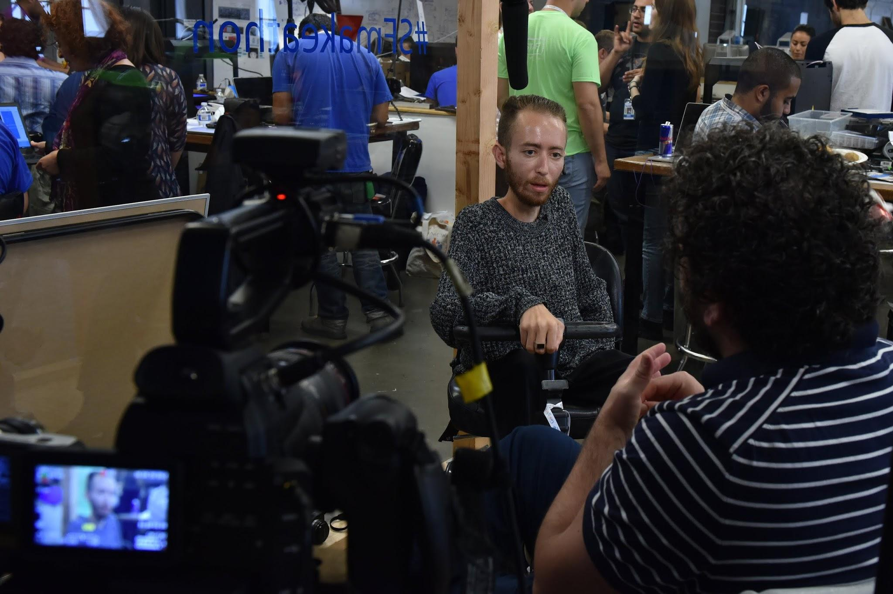
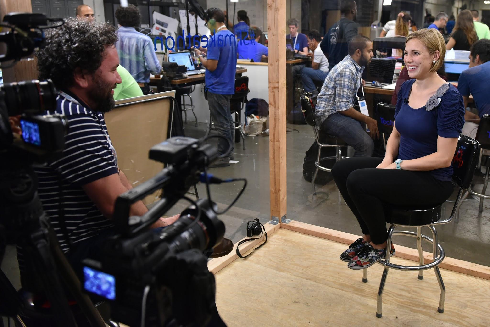

### Part 6: **PR/Marketing**

**Website**

Going live with your website will be one of the first things you do after you sign License 2. It will take you less than 4 hours to get the website for your event up and running. You do not need a programmer, IT guys or a designer; but it is helpful to recruit someone with Wordpress experience to help you out. Our web team will activate your website and provide your credentials to login.

You do not need a web designer or graphic designer but we do recommend recruiting someone with Wordpress experience to give a hand with uploading the content to the site.

* Upload your event logo and graphic

* Add your location and dates

* Upload your speakers and judges and their bios

* Update special details about your makeathon

* Add partner logos and your contact details

* Open the Call for Challenge and Call for Talent

**Collateral**

Signs, instructions, schedules, nametags and more. We have prepared a file of ready to print templates.

When creating any new collateral, make sure you follow the brand guidelines outlined in Part 2 of the book.

**Social Media**

Facebook, Twitter, Instagram! Choose your primary platform based on local social media culture. Your page should be named TOM:city name, TOM:acronym or TOM:university name. If your event name is already taken or is too long, review alternatives with your TOM POC.

**Social Media Tips**

Tip #1: Create a hashtag.

You are planning the coolest event in town and people will want to spread the word! Keep track about all the great buzz and make sure you respond to any questions and feedback you will receive. If you are using a hashtag, make sure to let people know they should use it—use it in e-mails, newsletters and on signage.

#TOMcityname

i.e. #TOMnyc

Tip #2: Post updates!

You are part of a growing movement, you should feel proud of newsworthy moments, updates and team solutions. If you don't post, no one will know. Post when you secure a partner, sponsor, speaker, call for challenge, call for talent, location, cool tools, spotlights, etc.

Tip #3: Use multiple social media outlets and use them well!

Depending on where you are in the world your participants will be active on a combination of channels. Adapt posts and share on multiple platforms to spread the reach of the TOM makeathon. At the same time be realistic—if you know you really only have time to share well on one channel, go with Facebook and do it well!

Tip #4: Get creative with your content!

It's super easy to share a quick update on a social media channel. Have fun with pictures, videos, GIF’s, infographics, prizes, press passes, etc. If you have an event blog, share posts from your blog or posts from industry blogs you think your participants will find interesting.

Tip #5: Hold onto the momentum

So you're posting, sharing and liking...the buzz is out there and you’re getting messages from Makers and Need Knowers who missed the call for challenges/call for talent. This is an awesome opportunity to connect Makers and Need Knowers to the local TOM community.

Tip #6: Social media is a community, join the conversation

You've got friends posting, commenting and tweeting... it’s a conversation... answer questions, give feedback, say thank you, set up a meeting in person!

**Blog**

A blog is a great way to get the word out about the exciting work you are doing with TOM. This is definitely optional and only recommended if you have someone responsible for powerful and interesting content.

**Media**

Whether you're reaching out to traditional media or bloggers, you need to assign one person to be the point of contact with a unified message about the event. Additionally, press should never wander unattended through the event.

1. **Build a press kit**: Event name, location, event logo, event organizers, mission of the event, short description of each challenge, quotes from community leaders and list of partners and sponsors.

2. **Local press:** Compile a list of local media outlets, bloggers and freelance writers that may be interested in the event.

3. **Press passes:** Let press know as early as possible that the event is happening and provide press passes for the PreTOM, TOM and PostTOM events.

4. **Press conference: **Assign a time on the second day of the event for all press to come to the TOM and meet each team to minimize interruption from the making.

5. **Press releases: **We have provided a template for your press releases. You must think strategically to optimize coverage.

    1. Event announcement and call for talent & call for challenge

    2. Press passes: details about the event, challenges and partners

    3. Post event: details about the event, spotlights on challenges and solutions, quotes, captioned photos and partners

6. **Assign a date** for partners to send out their own press releases. Our recommendation is that the official TOM event press releases are sent out a week before partners send out their own releases.

**Newsletters**

Your contact list includes participants, staff and partners! Ask your partners to share with their contact lists as well.

**TIP #1** Stories

The Makeathon story is all about bringing together Need Knowers and Makers working together to develop technological solutions for everyday challenges. These are real people each with a story that brought them to TOM. Share their story.

**TIP #2 **Upcoming events

From call to challenges & call for talents to press passes and tours of the makerspace to the closing event, let people know how they can attend and where they can RSVP.

**TIP #3** Join TOM

What are the next steps, let people know how they can get involved with the TOM community on an ongoing basis.

**Lights, Camera, Action!**

Documenting your TOM event is a must! We want to showcase all of the brilliancy of each event to share your accomplishments and inspire the global TOM community. You must hire photographers and videographers for the full three days of the makeathon.

When hiring a videographer, the scope of the project should include editing the video. You are responsible to develop an official video of the event within one month of the TOM. The first time the video will be shown is at the PostTOM event. If you find yourself behind schedule, you must speak with your point of contact and confirm an updated timeline.

Share raw footage with TOM POC to be used in official TOM materials within a week of the makeathon.

**_Nice idea:_*** produce mini-videos of each project.*

[https://www.youtube.com/watch?v=lIDfQyV5RW4](https://www.youtube.com/watch?v=lIDfQyV5RW4)
[https://www.youtube.com/watch?v=w36QAUA_Dkc](https://www.youtube.com/watch?v=w36QAUA_Dkc)

Photography guidelines:

1. TOM watermark

2. High resolution

3. Good lighting, if possible avoid direct flash

4. Pictures illustrating the process of the making

5. Team pictures

6. Individual pictures

7. Seize the moment

8. Upload pictures to social media for each day of the event

9. Caption 10 photos for TOM's official use explaining what is happening in the photo.

Videography guidelines:

1. Documenting each team's challenge: interview one representative from each team who will explain the challenge and the project.

2. Document the making of the prototype: welding, cutting, gluing, etc.)

3. Document the solution presented

4. Should be recorded in high quality with the best lighting

5. Interviews should be held in a room without noise, preferably with glass walls where you can see the makerspace in the background.

6. At the end of the video: must thank your partners and sponsors

7. Quick Reminder: Be mindful of using proper language when referring to people with disabilities.

8. Caption the videos for accessibility for hearing impaired

**PS: **Glass rooms have been built for makeathons, costing between $200-$2,000 to build. These are good places for interviews and for documenting the Makeathon. 
